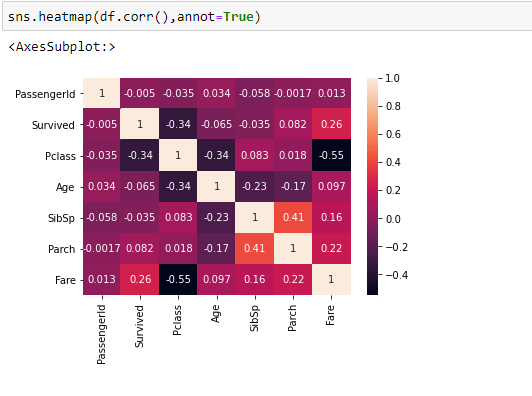

# Ex-03EDA

## AIM
To perform EDA on the given data set. 

# Explanation
The primary aim with exploratory analysis is to examine the data for distribution, outliers and 
anomalies to direct specific testing of your hypothesis.
 

# ALGORITHM
### STEP 1
Import the required packages(pandas,numpy,seaborn).
### STEP 2
Read the given csv file and convert them into Dataframe.
### STEP 3
As the first step remove the null values from the dataframe
### STEP 4
Return the objects containing counts of unique values using (value_counts()).
### STEP 5
Plot the counts in the form of Histogram or Bar Graph.
### STEP 6
Find the pairwise correlation of all columns in the dataframe.corr() and save the cleaned data to the file.


# CODE
```
import pandas as pd
import numpy as np
import seaborn as sns
df=pd.read_csv("titanic_dataset.csv")
df
df.info()
df.head()
df["Age"]=df["Age"].fillna(df["Age"].median())
df.boxplot()
df.isnull().sum()
df.drop("Cabin",axis=1,inplace=True)
df.info()
df["Embarked"]=df["Embarked"].fillna(df["Embarked"].mode())
df.isnull().sum()
df["Embarked"]=df["Embarked"].fillna(df["Embarked"].mode()[0])
df.isnull().sum()
df["Pclass"].value_counts()
sns.countplot(x="Survived",data=df)
sns.displot(df["Fare"])
sns.countplot(x="Pclass",hue="Survived",data=df)
sns.displot(df[df["Survived"]==0]["Age"])
pd.crosstab(df["Pclass"],df["Survived"])
df.corr()
sns.heatmap(df.corr(),annot=True)
```
# OUPUT
### INITIAL DATA


### OUTLIERS GRAPH

### CHECKING NULL VALUES


### GRAPH


### HEAT MAP


# RESULT
EDA on the given data set is performed successfully.
